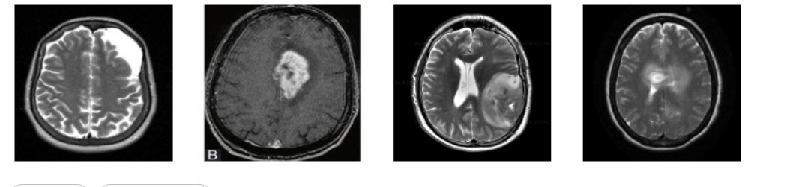

# 🧠 Brain Stroke Detection Web App

This project is a Flask-based web application that allows users to upload brain MRI images and detect signs of a stroke using a trained deep learning model.

## 🚀 Features

- Upload an MRI image from your device
- Deep learning model predicts whether a stroke is detected
- User-friendly web interface
- Automatically deletes uploaded files after prediction

## 🖼️ Demo

> Upload a brain scan image to check if a stroke is detected.

 <!-- You can add a real screenshot later -->

## 🛠️ Tech Stack

- Python
- Flask
- TensorFlow / Keras
- Pillow (PIL)
- HTML/CSS (frontend)

## 🧪 How It Works

1. User uploads an MRI image.
2. Image is preprocessed (resized, normalized).
3. The trained CNN model (`brain_tumor_classifier.h5`) predicts stroke presence.
4. Result and confidence score are displayed to the user.

## 📂 Folder Structure
```bash
brain_stroke_detection/
├── templates/          # HTML templates 
├── uploads/            # Temporarily stores uploaded images  
├── venv/               # Python virtual environment
├── main.py             # Flask backend code
├── brain_tumor_classifier.h5    # Trained Keras model
├── requirements.txt    # Python dependencies
└── .gitignore          # Git ignore rules
```
## ⚙️ Setup Instructions
# 1. Clone the repository
```bash
git clone https://github.com/tukus1963/Brain_Stroke_Detection.git
cd Brain_Stroke_Detection
```

# 2. Create a virtual environment
```bash
python -m venv venv
```

# 3. Activate the virtual environment
# On Windows
```bash
venv\Scripts\activate
```
# or
 # On macOS/Linux
```bash
source venv/bin/activate
```   
# 4. Install dependencies
```bash
pip install -r requirements.txt
```
# 5. Run the Flask app
```bash
python main.py
```
